<p align="center">
  
</p>

<h1 align="center">Video Diary App</h1>

<p align="center">
  Pick a video from your library, crop a <strong>5-second</strong> moment, give it a
  name and description, and save it to a local diary that survives app restarts.
</p>

---

## Overview

Video Diary App is a React Native (Expo) implementation of the **SevenApps React
Native case study**. It lets you build a personal diary out of short, 5-second
video clips: import a video, trim an exact 5-second segment, attach a title and
description, and keep everything in a persistent, offline list on your device.

The app is built around a small, modular architecture with a clear separation
between persisted state, async work, and UI. For the full requirements and the
phase-by-phase build plan, see [SCOPE.md](SCOPE.md) and [ROADMAP.md](ROADMAP.md).

---

## Features

- **Import** a video from the device library (videos only).
- **Crop** an exact 5-second window with a draggable scrubber — the end point
  locks automatically to `start + 5s`.
- **Add metadata** (name + description), validated with Zod + React Hook Form.
- **Persist** cropped clips in SQLite; the home screen lists them and survives
  restarts.
- **View** a clip on its detail page, or **edit** its name and description.
- **Native crop** runs through TanStack Query, with loading, error, and retry state.
- **Reanimated** touches: animated empty state, list-item entrance, and step fades.
- **Cross-platform** glass UI with NativeWind, plus a native tab bar.

---

## Tech stack

| Area | Library |
| --- | --- |
| Framework | Expo SDK 56 · React Native 0.85 · React 19 |
| Navigation | Expo Router (file-based, typed routes) |
| Global state | Zustand |
| Async / mutations | TanStack Query |
| Video cropping | expo-trim-video |
| Video playback | expo-video |
| Media import | expo-image-picker |
| Styling | NativeWind (Tailwind CSS) |
| Local storage | Expo SQLite |
| Forms & validation | React Hook Form + Zod |
| Animations | React Native Reanimated |
| Lists | Shopify FlashList |

---

## How it works

The project was built in five phases (see [ROADMAP.md](ROADMAP.md)):

1. **Setup & styling** — Expo project, dependencies, and NativeWind design system.
2. **Persistence** — SQLite database plus a Zustand store that mirrors it and acts
   as the single source of truth for the list (optimistic updates with rollback).
3. **Crop flow** — a 3-step modal (Select → Crop → Details). The 5-second trim runs
   via `expo-trim-video` inside a TanStack Query mutation; the output is written to
   disk and saved to SQLite.
4. **Screens** — home list, minimalist detail page, and an edit page that reuses the
   same metadata form.
5. **Enhancements** — Reanimated animations, cropped-file cleanup, and centralized
   error handling wired to TanStack Query's `onError`.

**State ownership:** the persisted list lives in the Zustand store
(`video-store.ts`) and is kept in sync with SQLite. TanStack Query is used only for
async/mutation work (the native crop and disk writes), providing loading/error/retry
state — there is no separate query cache for the list.

---

## Screenshots

### App Icon

<p align="center">
  
</p>

### iOS

<table>
  <tr>
    <td>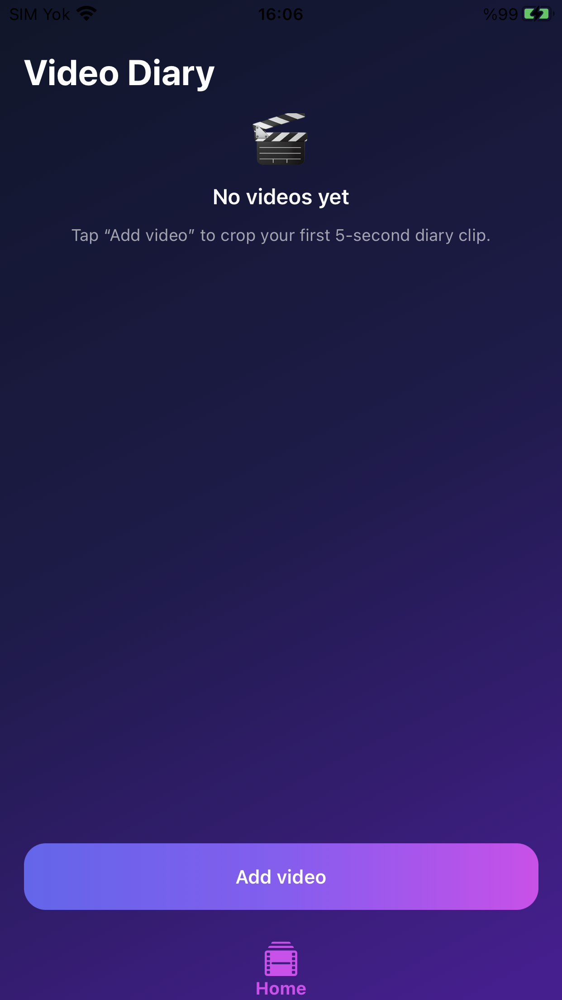</td>
    <td></td>
    <td>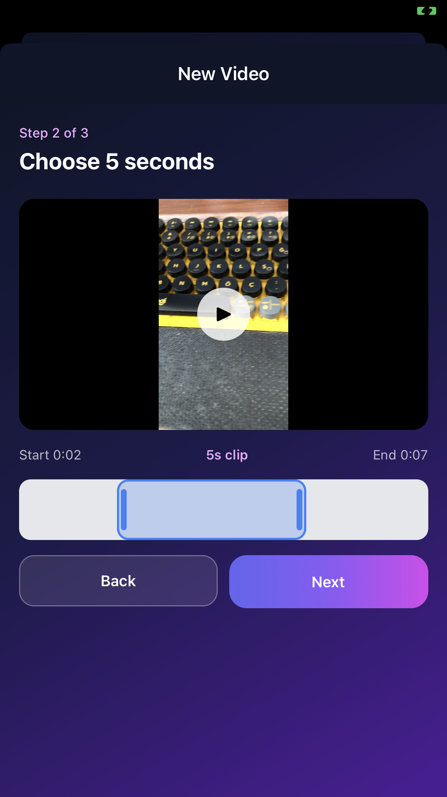</td>
    <td>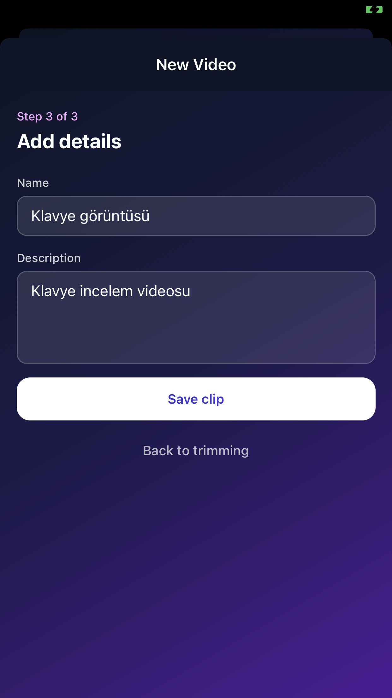</td>
  </tr>
  <tr>
    <td>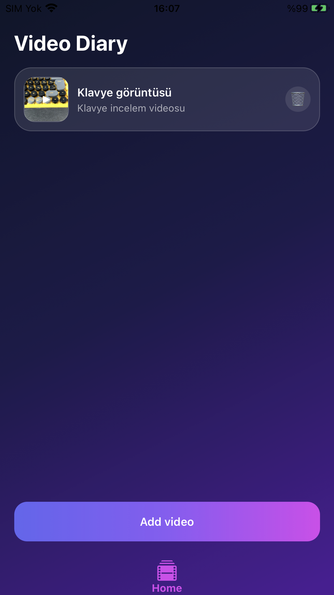</td>
    <td>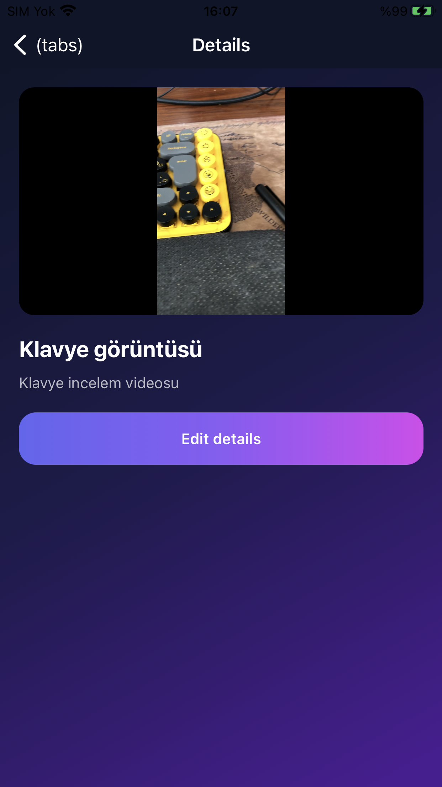</td>
    <td>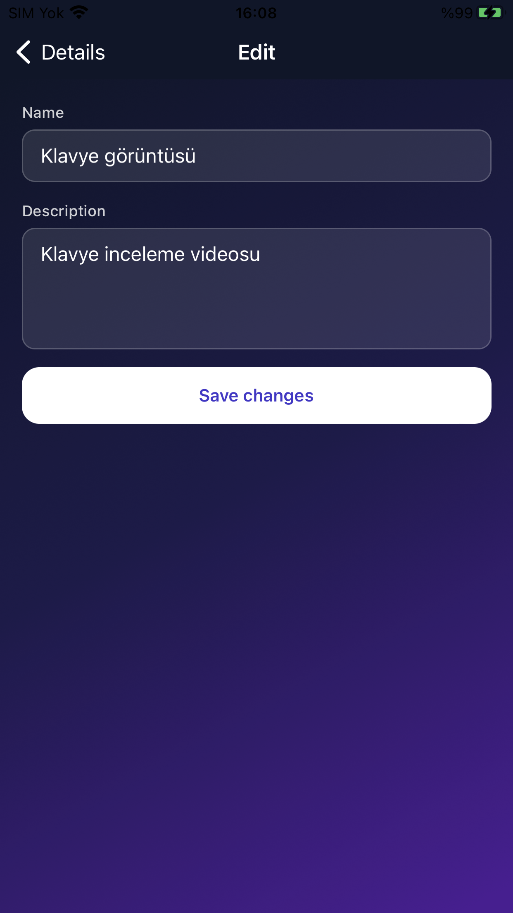</td>
    <td>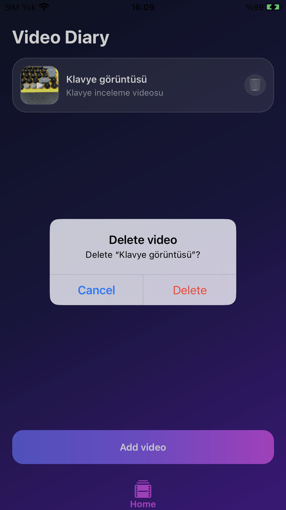</td>
  </tr>
</table>

### Android

<table>
  <tr>
    <td>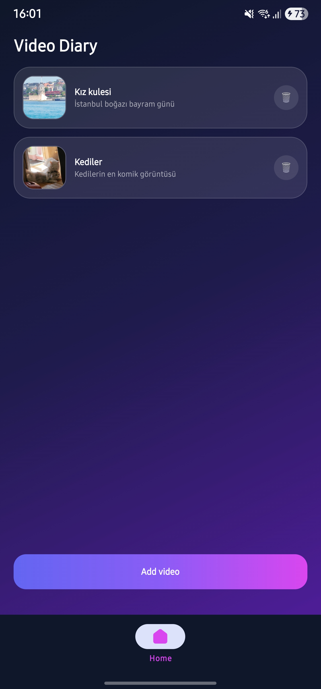</td>
    <td>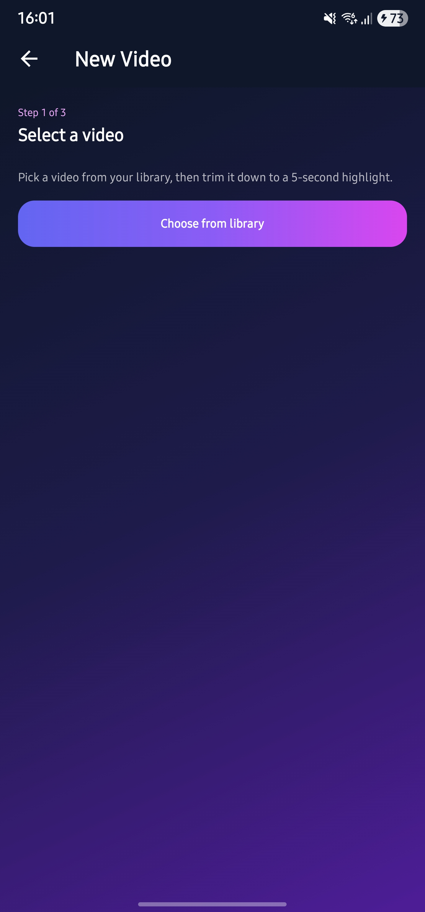</td>
    <td>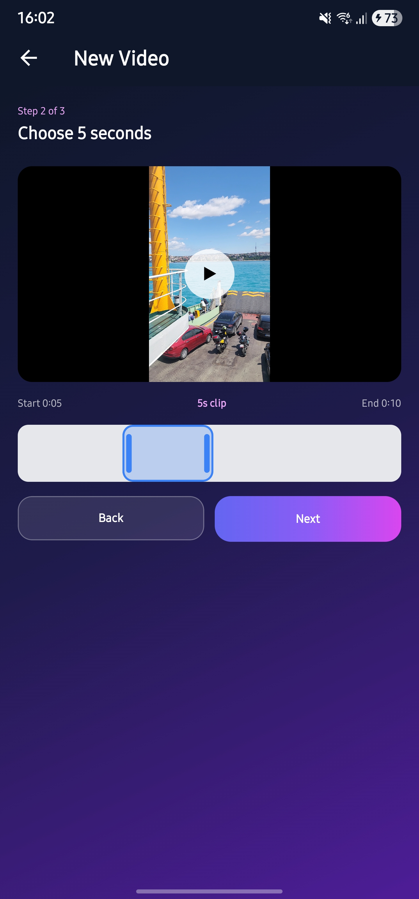</td>
    <td>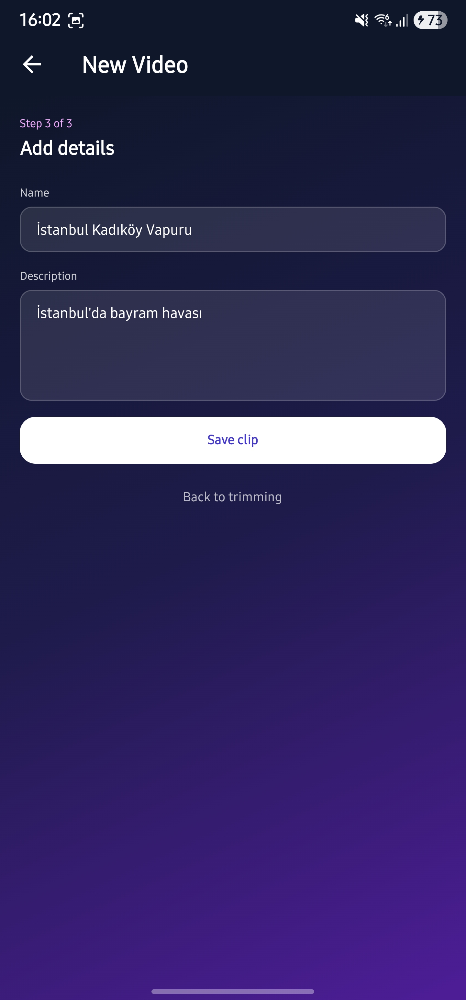</td>
  </tr>
  <tr>
    <td>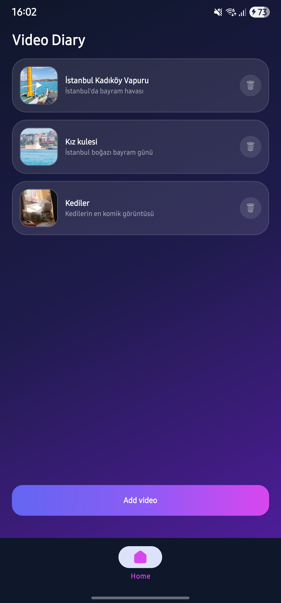</td>
    <td>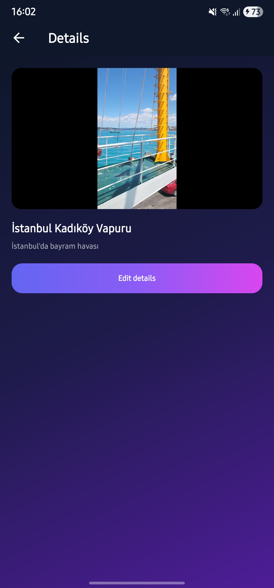</td>
    <td>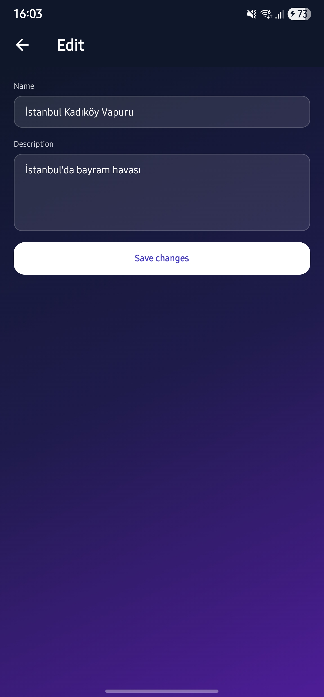</td>
    <td>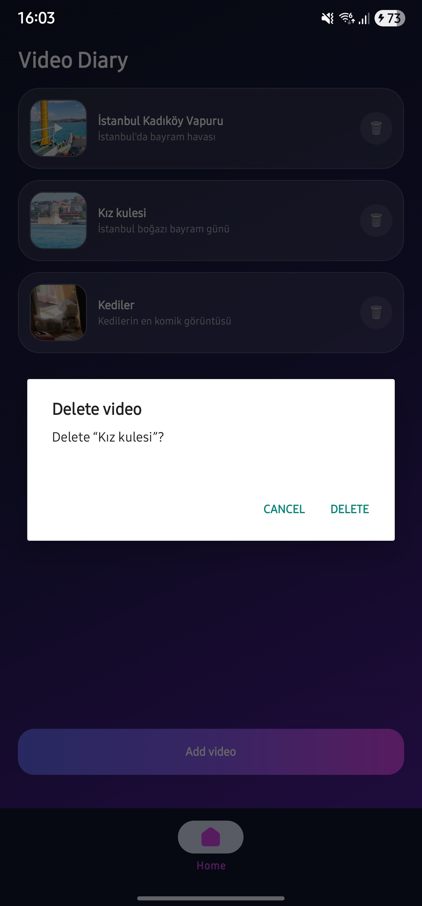</td>
  </tr>
</table>

---

## Getting started

> **Heads up:** `expo-trim-video` is a native module, so the app **cannot run in
> Expo Go**. You need a development build (`expo run:ios` / `expo run:android`).

### Prerequisites

- **Node.js 18+** and npm
- **Git**, and (recommended on macOS) **Watchman**
- **iOS:** macOS with **Xcode** and **CocoaPods**, plus an iOS Simulator or a
  connected device
- **Android:** **Android Studio** with the Android SDK and an emulator, or a
  device with USB debugging enabled

### 1. Install dependencies

```bash
npm install
```

### 2. Run on iOS

Builds the native app and launches it on the iOS Simulator (or a connected device):

```bash
npx expo run:ios
```

To target a specific simulator or a physical device:

```bash
npx expo run:ios --device
```

### 3. Run on Android

Start an emulator (or connect a device), then build and launch:

```bash
npx expo run:android
```

To pick a specific connected device:

```bash
npx expo run:android --device
```

### 4. Start the dev server

After the first native build is installed, you can start just the JavaScript dev
server for fast reloads:

```bash
npx expo start --dev-client
```

---

## Usage

1. On the home screen, tap **Add video**.
2. **Step 1 — Select:** choose a video (at least 5 seconds long) from your library.
3. **Step 2 — Crop:** drag the scrubber to pick the 5-second window to keep.
4. **Step 3 — Details:** enter a name (min 3 chars) and an optional description,
   then save.
5. The cropped clip appears in the list. Tap it to view, or open **Edit details**
   to change its metadata.

---

## Scripts

| Command | Description |
| --- | --- |
| `npm run ios` | Build and run the iOS development build |
| `npm run android` | Build and run the Android development build |
| `npm start` | Start the Expo dev server |
| `npm run web` | Run the app in a browser |
| `npm run lint` | Lint the project with ESLint |

---

## Project structure

All source code lives under `src/`, with the `@/*` alias mapped to `./src/*`.
Files use kebab-case naming.

```text
src/
├── app/                          # Expo Router file-based navigation
│   ├── _layout.tsx               # Root Stack (providers, theme, imports global.css)
│   ├── (tabs)/
│   │   ├── _layout.tsx           # Tab bar navigator (AppTabs)
│   │   └── index.tsx             # Home screen (list of cropped videos)
│   ├── crop-modal.tsx            # 3-step cropping flow (modal)
│   ├── details/[id].tsx          # Video detail page
│   └── edit/[id].tsx             # Edit name / description
├── components/
│   ├── crop/                     # select-step, crop-step, metadata-step, crop-preview
│   ├── home/                     # video-list-item, empty-state, video-thumbnail
│   ├── ui/                       # button, message, not-found, screen-background
│   ├── app-tabs.tsx              # Native tab bar (+ .web.tsx variant)
│   ├── metadata-form.tsx         # Shared Zod form (create & edit)
│   ├── scrubber.tsx              # Reanimated 5-second selection bar
│   ├── video-surface.tsx         # Shared video frame with play/pause overlay
│   └── video-player.tsx          # Expo Video player
├── constants/theme.ts            # Colors and fonts
├── db/                           # SQLite layer (database, schema, queries, index)
├── hooks/
│   ├── use-video.ts              # useVideoById selector
│   └── use-video-mutations.ts    # TanStack Query mutations (async only)
├── lib/
│   ├── errors.ts                 # Error-message and alert helpers
│   ├── query-client.ts           # Shared TanStack Query client
│   └── video-files.ts            # Cropped-file cleanup helper
├── store/
│   ├── video-store.ts            # Persisted list (source of truth, synced w/ SQLite)
│   └── video-editor-store.ts     # Ephemeral crop-flow state
└── global.css                    # NativeWind / Tailwind directives
```

---

## License

Released under the [MIT License](LICENSE).
